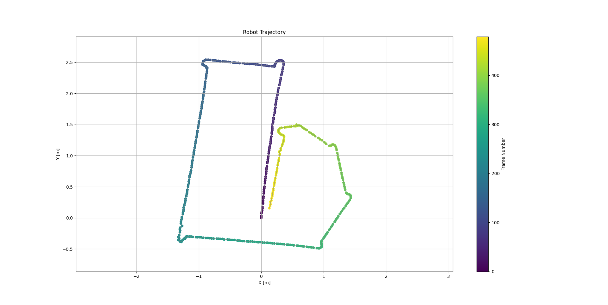

# Robotic Vision: Stereo Visual Odometry

Python code for the graded robotic vision and advanced robotic vision projects. 
Part 1 (lab project): Collecting a suitable dataset using a ZED camera, Nvidia Jetson Nano and a ESP32 robot. 
Part 2 (code project): Reconstructing the pose of the robot through the course purely based on the stereo images using Feature Matchung, PnP and RANSAC outlier rejection. For a smoother path a Kalman filter and Pose Graph Optimization where applied. 


## Robot Trajectory

**Trajectory prediction vs. Ground Truth**

| Trajectory prediction (Feature Matching) | Ground Truth (Vicon System) |
| ---------------------------------------- | ---------------------------- |
|  |  |

## Setup
```bash
# bash
python3 -m venv .venv
source .venv/bin/activate
python -m pip install --upgrade pip
pip install -r requirements.txt
```

```powershell
# powershell
python -m venv .venv
. .\.venv\Scripts\Activate.ps1
python -m pip install --upgrade pip
pip install -r requirements.txt
```

